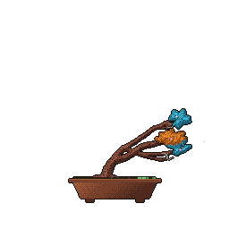

<h1 align="center">Hi 👋, I'm Anastasia</h1>
<h3 align="center">Frontend & Mobile Developer from Germany · Angular · Flutter · TypeScript</h3>
 

  
  

---
 

### 🌱 About me
 
- 💻 **Fachinformatikerin für Anwendungsentwicklung (IHK)** – I came into development through a retraining program and never looked back
- 🏢 Built logistics web apps for an ERP system (**Angular** frontend, Progress ABL backend)
- 🎨 Currently building mobile-first websites and **Directus**-based internal tools at an agency
- 📱 Side projects in **Flutter** with Supabase, Riverpod and Clean Architecture
- 🧩 I care about clean component architecture, design systems and turning Figma designs into real UIs
- 📚 Off-screen: anime, books, games – and two black cats 🐈‍⬛🐈‍⬛
 

### 🛠️ Tech Stack
 

  
   
  
   
  

Also: Directus · Progress ABL · n8n · Riverpod · Widgetbook
 
### 🚀 Featured Projects
 
| Project | What it is | Stack |
|---|---|---|
| 🚲 **[BikeDrop](https://github.com/Anastasia9595/)** | Inventory & goods-receipt app for bike shop staff – stock list, barcode scan, scan cart with completeness check | Flutter · Riverpod · Supabase · Clean Architecture · Atomic Design · Widgetbook · GitHub Actions |
| 📦 **[Collector App](https://github.com/Anastasia9595/)** | Track your collections – books, manga, board games, figures, games – with a dark, atmospheric card UI | Flutter · Riverpod Codegen · Freezed · Repository Pattern |
| 🗂️ **[Project Tracker](https://github.com/Anastasia9595/)** | Project management & time tracking for print runs, replacing a legacy FileMaker workflow | Directus · Astro · React · shadcn/ui · Turborepo |
 
<!-- TODO: Links oben auf die echten Repos / Live-Demos setzen -->
 
### 📫 Connect with me
 

  
  

---
 

  

