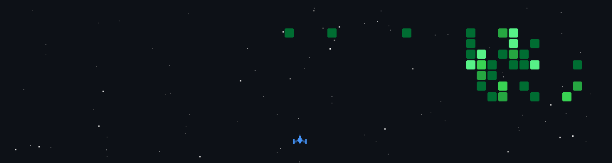

<h1 align="center">Hi 👋, I'm Anastasia</h1>
<h3 align="center">Frontend & Mobile Developer from Germany · Angular · Flutter · TypeScript</h3>
 

  
  

---
 

### 🌱 About me
 
- 💻 **Fachinformatikerin für Anwendungsentwicklung (IHK)** – I came into development through a retraining program and never looked back
- 🏢 Built logistics web apps for an ERP system (**Angular** frontend, Progress ABL backend)
- 🎨 Currently building mobile-first websites and **Directus**-based internal tools at an agency
- 📱 Side projects in **Flutter** with Supabase, Riverpod and Clean Architecture
- 🧩 I care about clean component architecture, design systems and turning Figma designs into real UIs
- 📚 Off-screen: anime, books, games – and two black cats 🐈‍⬛🐈‍⬛
 

### 🛠️ Tech Stack
 

  
   
  
   
  

Also: Directus · Progress ABL · n8n · Riverpod · Widgetbook

<h3>👾 My Contributions</h3>

  

<h3>🚀 Featured Projects</h3>

<table>
  <tr>
    <td width="33%" valign="top" align="center">
      <h4>🚲 BikeDrop</h4>
      Inventar- & Wareneingangs-App für Fahrradhändler: Bestandsliste, Barcode-Scan, Scan-Warenkorb
        
      
        
      
      
    </td>
    <td width="33%" valign="top" align="center">
      <h4>📦 Collector App</h4>
      Sammlungen verwalten: Bücher, Manga, Brettspiele, Figuren – mit dunkler, atmosphärischer UI
        
      
        
      
    </td>
    <td width="33%" valign="top" align="center">
      <h4>🗂️ Project Tracker</h4>
      Projektmanagement & Zeiterfassung für Druckstrecken, Ersatz für einen alten FileMaker-Workflow
        
      
       + Directus · shadcn/ui · Turborepo
        
      
    </td>
  </tr>
</table>
 
 
 
### 📫 Connect with me
 

  

---
 

  

